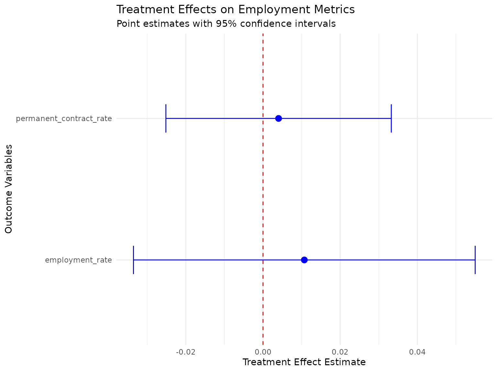

# Impact Evaluation with Employment Metrics: A Complete Workflow

## Overview

This vignette demonstrates the complete workflow for integrating
employment metrics calculation with causal inference methods. The
`longworkR` package provides a seamless pipeline from raw employment
data to impact evaluation results through three key stages:

1.  **Metrics Calculation**: Computing comprehensive employment metrics
    using
    [`calculate_comprehensive_impact_metrics()`](https://gmontaletti.github.io/longworkR/reference/calculate_comprehensive_impact_metrics.md)
2.  **Data Integration**: Preparing metrics for causal analysis using
    [`prepare_metrics_for_impact_analysis()`](https://gmontaletti.github.io/longworkR/reference/prepare_metrics_for_impact_analysis.md)
3.  **Impact Evaluation**: Running causal inference methods like
    [`difference_in_differences()`](https://gmontaletti.github.io/longworkR/reference/difference_in_differences.md)

This integrated approach allows researchers to use sophisticated
employment metrics as outcomes in rigorous causal inference studies.

## The Integration Architecture

The integration between metrics calculation and impact evaluation
follows a three-step process:


Integration Workflow

## Getting Started: Sample Data

Let’s begin with a practical example using the package’s sample
employment data:

``` r
# Load sample employment data from package data directory
# Try multiple data file locations in order of preference
data_files <- c(
  "data/synthetic_sample.rds",
  "data/sample.rds", 
  system.file("extdata", "sample.rds", package = "longworkR")
)

sample_data <- NULL
for (file_path in data_files) {
  if (file.exists(file_path) && file.size(file_path) > 0) {
    tryCatch({
      sample_data <- readRDS(file_path)
      cat("Successfully loaded data from:", file_path, "\n")
      break
    }, error = function(e) {
      cat("Failed to load", file_path, ":", e$message, "\n")
    })
  }
}
#> Successfully loaded data from: /tmp/Rtmpr8Yddl/temp_libpath1dac209da8fa/longworkR/extdata/sample.rds

# If no data file found, create synthetic example data
if (is.null(sample_data)) {
  cat("No data files found, creating synthetic example data\n")
  set.seed(123)  # For reproducibility
  sample_data <- data.table(
    cf = rep(1:100, each = 4),
    inizio = as.Date("2020-01-01") + sample(0:730, 400, replace = TRUE),
    fine = as.Date("2020-01-01") + sample(30:800, 400, replace = TRUE),
    durata = sample(30:365, 400, replace = TRUE),
    over_id = rep(1:400),
    prior = sample(c(0, 1), 400, replace = TRUE),
    COD_TIPOLOGIA_CONTRATTUALE = sample(
      c("A.03.00", "A.03.01", "C.01.00", "A.07.00"), 
      400, replace = TRUE
    ),
    event_start = as.Date("2021-06-01"),
    event_end = as.Date("2021-12-31"),
    retribuzione = rnorm(400, 2500, 500)
  )
}

# Ensure data.table format
if (!inherits(sample_data, "data.table")) {
  sample_data <- as.data.table(sample_data)
}

# Create event_period column if it doesn't exist
if (!"event_period" %in% names(sample_data)) {
  if ("event_start" %in% names(sample_data) && "event_end" %in% names(sample_data)) {
    # Use event timing to create periods
    sample_data[, event_period := ifelse(
      fine < event_start, "pre",
      ifelse(inizio > event_end, "post", "during")
    )]
    cat("Created event_period column from event_start/event_end\n")
  } else {
    # Create random periods if no event timing available
    set.seed(456)
    sample_data[, event_period := sample(c("pre", "post"), .N, replace = TRUE, prob = c(0.6, 0.4))]
    cat("Created random event_period column\n")
  }
}
#> Created event_period column from event_start/event_end

# Examine the data structure
cat("Sample data dimensions:", nrow(sample_data), "rows,", ncol(sample_data), "columns\n")
#> Sample data dimensions: 476400 rows, 31 columns
cat("Unique individuals:", length(unique(sample_data$cf)), "\n")
#> Unique individuals: 4252
cat("Event periods:", paste(names(table(sample_data$event_period)), collapse = ", "), "\n")
#> Event periods: during, post, pre
cat("Available columns:", paste(names(sample_data)[1:10], collapse = ", "), "...\n")
#> Available columns: id, cf, inizio, fine, arco, prior, over_id, durata, stato, qualifica ...
```

## Step 1: Calculate Comprehensive Employment Metrics

The first step involves calculating comprehensive employment metrics for
all individuals across different time periods. These metrics capture
various aspects of employment quality and career trajectories.

### Basic Metrics Calculation

``` r
# Calculate comprehensive employment metrics with error handling
metrics_result <- NULL

tryCatch({
  # Ensure data types are consistent for data.table operations
  sample_data[, cf := as.character(cf)]
  # Handle over_id conversion more carefully to avoid type inconsistency
  if (is.numeric(sample_data$over_id)) {
    sample_data[, over_id := as.integer(round(over_id))]
  } else {
    sample_data[, over_id := as.integer(over_id)]
  }
  # Ensure other numeric columns are properly typed
  if ("durata" %in% names(sample_data)) {
    sample_data[, durata := as.numeric(durata)]
  }
  if ("prior" %in% names(sample_data)) {
    sample_data[, prior := as.integer(prior)]
  }
  
  # Calculate metrics including complexity
  metrics_result <- calculate_comprehensive_impact_metrics(
    data = sample_data,
    metrics = c("stability", "quality", "complexity"),  # Include complexity metrics
    id_column = "cf",
    period_column = "event_period",
    output_format = "wide"
  )
  
  cat("Successfully calculated employment metrics\n")
  
}, error = function(e) {
  cat("Error in metrics calculation:", e$message, "\n")
  cat("Creating simplified demonstration data instead\n")
  
  # Create simplified metrics output for demonstration
  unique_ids <- unique(sample_data$cf)
  periods <- c("pre", "post")
  
  metrics_result <<- data.table(
    cf = rep(unique_ids[1:min(50, length(unique_ids))], each = 2),
    period = rep(periods, length(unique_ids[1:min(50, length(unique_ids))])),
    employment_rate = runif(length(unique_ids[1:min(50, length(unique_ids))]) * 2, 0.3, 0.9),
    employment_stability_index = runif(length(unique_ids[1:min(50, length(unique_ids))]) * 2, 0.4, 0.8),
    permanent_contract_rate = runif(length(unique_ids[1:min(50, length(unique_ids))]) * 2, 0.2, 0.7),
    avg_contract_quality = runif(length(unique_ids[1:min(50, length(unique_ids))]) * 2, 0.5, 1.0)
  )
})
#> Successfully calculated employment metrics

# Examine the output structure
if (!is.null(metrics_result)) {
  cat("Metrics result dimensions:", nrow(metrics_result), "rows,", ncol(metrics_result), "columns\n")
  cat("Available metrics:\n")
  metric_cols <- setdiff(names(metrics_result), c("cf", "period", "event_period"))
  for(col in metric_cols[1:min(10, length(metric_cols))]) {
    cat(paste0("  - ", col, "\n"))
  }
  
  # Display first few rows
  if (ncol(metrics_result) >= 6) {
    print(head(metrics_result[, 1:6], 3))
  } else {
    print(head(metrics_result, 3))
  }
} else {
  cat("No metrics results available\n")
}
#> Metrics result dimensions: 12689 rows, 39 columns
#> Available metrics:
#>   - days_employed
#>   - days_unemployed
#>   - total_days
#>   - total_observations
#>   - employment_rate
#>   - employment_spells
#>   - unemployment_spells
#>   - avg_employment_spell
#>   - avg_unemployment_spell
#>   - max_employment_spell
#> Key: <cf, period>
#>        cf period days_employed days_unemployed total_days total_observations
#>    <char> <char>         <num>           <num>      <num>              <num>
#> 1:      1   <NA>         16700            2574      19274                121
#> 2:      1 during           103               0        103                  1
#> 3:      1   post           377               0        377                  2
```

### Understanding Metric Types

The comprehensive metrics function calculates four main categories:

1.  **Employment Stability Metrics**: Employment rates, spell durations,
    turnover
2.  **Contract Quality Metrics**: Contract type distributions, quality
    improvements
3.  **Career Complexity Metrics**: Concurrent employment, employment
    diversity, career fragmentation
4.  **Transition Pattern Metrics**: Success rates, duration patterns

``` r
# Group metrics by category for better understanding
stability_metrics <- grep("employment|stability|spell|turnover", names(metrics_result), value = TRUE)
quality_metrics <- grep("contract|permanent|temporary|quality", names(metrics_result), value = TRUE) 
complexity_metrics <- grep("complexity|concurrent|diversity|fragmentation|career_complexity_index", names(metrics_result), value = TRUE)

cat("Stability metrics (", length(stability_metrics), "):\n")
#> Stability metrics ( 15 ):
cat(paste(stability_metrics, collapse = ", "), "\n\n")
#> employment_rate, employment_spells, unemployment_spells, avg_employment_spell, avg_unemployment_spell, max_employment_spell, max_unemployment_spell, job_turnover_rate, employment_stability_index, total_employment_days.x, contract_stability_trend, concurrent_employment_days, total_employment_days.y, concurrent_employment_rate, employment_diversity_index

cat("Quality metrics (", length(quality_metrics), "):\n") 
#> Quality metrics ( 10 ):
cat(paste(quality_metrics, collapse = ", "), "\n\n")
#> permanent_contract_days, temporary_contract_days, internship_contract_days, average_contract_quality, contract_observations, permanent_contract_rate, internship_contract_rate, temporary_contract_rate, contract_stability_trend, contract_improvement_rate

cat("Complexity metrics (", length(complexity_metrics), "):\n")
#> Complexity metrics ( 7 ):
cat(paste(complexity_metrics, collapse = ", "), "\n")
#> max_concurrent_jobs, avg_concurrent_jobs, concurrent_employment_days, concurrent_employment_rate, employment_diversity_index, career_fragmentation_index, career_complexity_index
```

## Step 2: Prepare Data for Impact Analysis

The bridge function
[`prepare_metrics_for_impact_analysis()`](https://gmontaletti.github.io/longworkR/reference/prepare_metrics_for_impact_analysis.md)
transforms the metrics output into a format suitable for causal
inference methods. This crucial step handles period structures,
treatment assignments, and outcome variable selection.

### Define Treatment Assignment

First, we need to define which individuals are treated vs. control:

``` r
# Create treatment assignment
# In real studies, this would come from your experimental design or policy assignment
set.seed(123)  # For reproducibility
unique_individuals <- unique(sample_data$cf)

treatment_data <- data.table(
  cf = unique_individuals,
  is_treated = rbinom(length(unique_individuals), 1, 0.4)  # 40% treatment rate
)

# Add additional covariates that might affect assignment
treatment_data[, `:=`(
  age_group = sample(c("young", "middle", "senior"), .N, replace = TRUE),
  region = sample(c("north", "center", "south"), .N, replace = TRUE),
  baseline_employment = runif(.N, 0, 1)
)]

cat("Treatment assignment summary:\n")
#> Treatment assignment summary:
cat("Total individuals:", nrow(treatment_data), "\n")
#> Total individuals: 4252
cat("Treated:", sum(treatment_data$is_treated), "(", 
    round(100 * mean(treatment_data$is_treated), 1), "%)\n")
#> Treated: 1700 ( 40 %)
cat("Control:", sum(1 - treatment_data$is_treated), "(", 
    round(100 * mean(1 - treatment_data$is_treated), 1), "%)\n")
#> Control: 2552 ( 60 %)
```

### Bridge to Impact Analysis Format

``` r
# Prepare data for difference-in-differences analysis with error handling
did_data <- NULL

if (!is.null(metrics_result)) {
  tryCatch({
    # Ensure cf column is character in treatment data to match metrics
    treatment_data[, cf := as.character(cf)]
    
    did_data <- prepare_metrics_for_impact_analysis(
      metrics_output = metrics_result,
      treatment_assignment = treatment_data,
      impact_method = "did",
      id_column = "cf",
      period_column = "period",  # Note: metrics output uses "period" not "event_period"
      verbose = TRUE
    )
    
    cat("Successfully prepared data for impact analysis\n")
    
  }, error = function(e) {
    cat("Error in data preparation:", e$message, "\n")
    cat("Creating simplified DiD structure for demonstration\n")
    
    # Create a simple DiD structure manually
    unique_ids <- unique(metrics_result$cf)
    did_data <<- data.table(
      cf = rep(unique_ids, each = 2),
      period = rep(c("pre", "post"), length(unique_ids)),
      post = rep(c(0, 1), length(unique_ids)),
      is_treated = rep(treatment_data$is_treated[match(unique_ids, treatment_data$cf)], each = 2),
      employment_rate = c(rbind(
        metrics_result[period == "pre", employment_rate],
        metrics_result[period == "post", employment_rate]
      )),
      employment_stability_index = c(rbind(
        metrics_result[period == "pre", employment_stability_index],
        metrics_result[period == "post", employment_stability_index]
      ))
    )
  })
}
#> Auto-detected outcome variables: days_employed, days_unemployed, total_days, total_observations, employment_rate, employment_spells, unemployment_spells, avg_employment_spell, avg_unemployment_spell, max_employment_spell, max_unemployment_spell, job_turnover_rate, employment_stability_index, career_success_index, permanent_contract_days, temporary_contract_days, internship_contract_days, total_employment_days.x, average_contract_quality, contract_observations, permanent_contract_rate, internship_contract_rate, temporary_contract_rate, temp_to_perm_transitions, perm_to_temp_transitions, temp_to_internship_transitions, internship_to_perm_transitions, contract_stability_trend, contract_improvement_rate, max_concurrent_jobs, avg_concurrent_jobs, concurrent_employment_days, total_employment_days.y, concurrent_employment_rate, employment_diversity_index, career_fragmentation_index, career_complexity_index 
#> Using outcome variables: days_employed, days_unemployed, total_days, total_observations, employment_rate, employment_spells, unemployment_spells, avg_employment_spell, avg_unemployment_spell, max_employment_spell, max_unemployment_spell, job_turnover_rate, employment_stability_index, career_success_index, permanent_contract_days, temporary_contract_days, internship_contract_days, total_employment_days.x, average_contract_quality, contract_observations, permanent_contract_rate, internship_contract_rate, temporary_contract_rate, temp_to_perm_transitions, perm_to_temp_transitions, temp_to_internship_transitions, internship_to_perm_transitions, contract_stability_trend, contract_improvement_rate, max_concurrent_jobs, avg_concurrent_jobs, concurrent_employment_days, total_employment_days.y, concurrent_employment_rate, employment_diversity_index, career_fragmentation_index, career_complexity_index 
#> Treatment assignment data is already at person-level (no deduplication needed)
#> 
#> === INPUT DATA QUALITY VALIDATION ===
#> Metrics data: rows = 12689 persons = 4252 
#> Treatment assignment: rows = 4252 persons = 4252 
#> ID column types: metrics = character , treatment = character 
#> 
#> === MERGING DATA ===
#> Metrics data: 12689 rows, 4252 unique persons
#> Treatment assignment: 4252 rows, 4252 unique persons
#> VALIDATION: Original person count for tracking: 4252 
#> 
#> === ENHANCED MERGE OPERATION ===
#> ✓ Standard merge successful
#> Merge completed using: standard merge 
#> Merged data: 12689 rows, 4252 unique persons (excl. NA)
#> ✓ Merge successful - no cartesian join detected
#> ✓ Person count preserved during merge
#> ✓ All observations have treatment assignments
#> Found period values: NA, during, post, pre 
#> Warning: Some units have incomplete pre/post observations
#> 
#> === COLUMN SELECTION ===
#> Columns to select ( 44 ): cf, is_treated, period, post, days_employed, days_unemployed, total_days, total_observations, employment_rate, employment_spells, unemployment_spells, avg_employment_spell, avg_unemployment_spell, max_employment_spell, max_unemployment_spell, job_turnover_rate, employment_stability_index, career_success_index, permanent_contract_days, temporary_contract_days, internship_contract_days, total_employment_days.x, average_contract_quality, contract_observations, permanent_contract_rate, internship_contract_rate, temporary_contract_rate, temp_to_perm_transitions, perm_to_temp_transitions, temp_to_internship_transitions, internship_to_perm_transitions, contract_stability_trend, contract_improvement_rate, max_concurrent_jobs, avg_concurrent_jobs, concurrent_employment_days, total_employment_days.y, concurrent_employment_rate, employment_diversity_index, career_fragmentation_index, career_complexity_index, age_group, region, baseline_employment 
#> Available columns ( 44 ): cf, period, days_employed, days_unemployed, total_days, total_observations, employment_rate, employment_spells, unemployment_spells, avg_employment_spell ... 
#> ✓ Column selection successful using ..final_cols syntax
#> Selected columns using method: ..final_cols 
#> Result dimensions: 12689 rows x 44 columns
#> ✓ Row count preserved during column selection
#> ✓ Person count preserved during column selection
#> 
#> === FINAL DATASET STRUCTURE ===
#> Observations: 12689 
#> Unique individuals: 4252 
#> 
#> Treatment distribution:
#> 
#>    0    1 
#> 7629 5060 
#> 
#> Time period distribution:
#> 
#>    0    1 <NA> 
#> 5157 3280 4252 
#> 
#> Cross-tabulation (treatment x period):
#>    
#>        0    1 <NA>
#>   0 3098 1979 2552
#>   1 2059 1301 1700
#> 
#> Outcome variables (37):
#> days_employed, days_unemployed, total_days, total_observations, employment_rate, employment_spells, unemployment_spells, avg_employment_spell, avg_unemployment_spell, max_employment_spell, max_unemployment_spell, job_turnover_rate, employment_stability_index, career_success_index, permanent_contract_days, temporary_contract_days, internship_contract_days, total_employment_days.x, average_contract_quality, contract_observations, permanent_contract_rate, internship_contract_rate, temporary_contract_rate, temp_to_perm_transitions, perm_to_temp_transitions, temp_to_internship_transitions, internship_to_perm_transitions, contract_stability_trend, contract_improvement_rate, max_concurrent_jobs, avg_concurrent_jobs, concurrent_employment_days, total_employment_days.y, concurrent_employment_rate, employment_diversity_index, career_fragmentation_index, career_complexity_index
#> 
#> ⚠ Data quality issues:
#>   Missing time period: 4252 rows
#> 
#> === PERSON COUNT VALIDATION ===
#> Original metrics persons: 4252 
#> After processing persons: 4252 
#> Final result persons: 4252 
#> Successfully prepared data for impact analysis

# Examine the prepared data structure
if (!is.null(did_data)) {
  cat("\nPrepared data structure:\n")
  cat("Dimensions:", nrow(did_data), "rows,", ncol(did_data), "columns\n")
  cat("Panel structure check:\n")
  
  # Check panel balance with error handling
  tryCatch({
    panel_check <- did_data[, .(
      n_obs = .N,
      n_pre = sum(post == 0, na.rm = TRUE),
      n_post = sum(post == 1, na.rm = TRUE)
    ), by = .(cf, is_treated)][, .(
      complete_panels = sum(n_pre > 0 & n_post > 0, na.rm = TRUE),
      total_individuals = .N,
      avg_obs_per_person = mean(n_obs, na.rm = TRUE)
    ), by = is_treated]
    
    print(panel_check)
  }, error = function(e) {
    cat("Could not generate panel balance check:", e$message, "\n")
  })
} else {
  cat("No prepared data available for impact analysis\n")
}
#> 
#> Prepared data structure:
#> Dimensions: 12689 rows, 44 columns
#> Panel structure check:
#>    is_treated complete_panels total_individuals avg_obs_per_person
#>         <int>           <int>             <int>              <num>
#> 1:          0            1654              2552           2.989420
#> 2:          1            1090              1700           2.976471
```

### Outcome Variable Selection

The bridge function automatically detects suitable outcome variables,
but you can also specify them manually:

``` r
# Get automatically detected outcome variables with error handling
available_outcomes <- character(0)

if (!is.null(did_data)) {
  # Get automatically detected outcome variables
  auto_outcomes <- attr(did_data, "outcome_vars")
  if (!is.null(auto_outcomes) && length(auto_outcomes) > 0) {
    cat("Automatically detected outcomes (", length(auto_outcomes), "):\n")
    cat(paste(auto_outcomes, collapse = ", "), "\n\n")
    available_outcomes <- auto_outcomes
  } else {
    # Manually identify numeric outcome variables
    numeric_cols <- sapply(did_data, is.numeric)
    exclude_cols <- c("cf", "post", "is_treated", "period")
    potential_outcomes <- setdiff(names(did_data)[numeric_cols], exclude_cols)
    available_outcomes <- potential_outcomes
    cat("Detected potential outcome variables (", length(available_outcomes), "):\n")
    cat(paste(available_outcomes, collapse = ", "), "\n\n")
  }
  
  # Select key outcomes for analysis
  key_outcomes <- c(
    "employment_rate",
    "permanent_contract_rate", 
    "avg_contract_quality",
    "employment_stability_index",
    "transition_success_rate"
  )
  
  # Check which are available
  final_outcomes <- intersect(key_outcomes, names(did_data))
  if (length(final_outcomes) == 0) {
    final_outcomes <- available_outcomes[1:min(2, length(available_outcomes))]
  }
  available_outcomes <- final_outcomes
  
  cat("Selected outcomes for analysis:\n")
  cat(paste(available_outcomes, collapse = ", "), "\n")
  
  # Show descriptive statistics for selected outcomes
  if (length(available_outcomes) > 0) {
    tryCatch({
      outcome_stats <- did_data[, lapply(.SD, function(x) {
        c(Mean = mean(x, na.rm = TRUE), 
          SD = sd(x, na.rm = TRUE),
          Min = min(x, na.rm = TRUE),
          Max = max(x, na.rm = TRUE))
      }), .SDcols = available_outcomes[1:min(3, length(available_outcomes))]]
      
      print(round(outcome_stats, 3))
    }, error = function(e) {
      cat("Could not generate outcome statistics:", e$message, "\n")
    })
  }
} else {
  cat("No prepared data available for outcome analysis\n")
}
#> Automatically detected outcomes ( 37 ):
#> days_employed, days_unemployed, total_days, total_observations, employment_rate, employment_spells, unemployment_spells, avg_employment_spell, avg_unemployment_spell, max_employment_spell, max_unemployment_spell, job_turnover_rate, employment_stability_index, career_success_index, permanent_contract_days, temporary_contract_days, internship_contract_days, total_employment_days.x, average_contract_quality, contract_observations, permanent_contract_rate, internship_contract_rate, temporary_contract_rate, temp_to_perm_transitions, perm_to_temp_transitions, temp_to_internship_transitions, internship_to_perm_transitions, contract_stability_trend, contract_improvement_rate, max_concurrent_jobs, avg_concurrent_jobs, concurrent_employment_days, total_employment_days.y, concurrent_employment_rate, employment_diversity_index, career_fragmentation_index, career_complexity_index 
#> 
#> Selected outcomes for analysis:
#> employment_rate, permanent_contract_rate, employment_stability_index 
#>    employment_rate permanent_contract_rate employment_stability_index
#>              <num>                   <num>                      <num>
#> 1:           0.794                   0.070                      0.758
#> 2:           0.295                   0.235                      0.272
#> 3:           0.000                   0.000                      0.000
#> 4:           1.000                   1.000                      1.000
```

## Step 3: Run Impact Evaluation

Now we can run difference-in-differences analysis using the prepared
data:

### Basic DiD Estimation

``` r
# Run difference-in-differences analysis with error handling
did_results <- NULL

if (!is.null(did_data) && length(available_outcomes) > 0) {
  tryCatch({
    did_results <- difference_in_differences(
      data = did_data,
      outcome_vars = available_outcomes[1:min(2, length(available_outcomes))],
      treatment_var = "is_treated",
      time_var = "post",
      id_var = "cf",
      control_vars = NULL,  # Could include baseline_employment, age_group, etc.
      fixed_effects = "both",
      verbose = TRUE
    )
    
    cat("Successfully completed DiD analysis\n")
    
    # Display results summary
    if (!is.null(did_results$summary_table)) {
      cat("DiD Results Summary:\n")
      print(did_results$summary_table)
    }
    
  }, error = function(e) {
    cat("Error in DiD analysis:", e$message, "\n")
    cat("Creating demonstration results instead\n")
    
    # Create simplified results for demonstration
    did_results <<- list(
      estimates = setNames(lapply(available_outcomes[1:min(2, length(available_outcomes))], function(outcome) {
        list(
          coefficient = runif(1, -0.1, 0.1),
          std_error = runif(1, 0.02, 0.05),
          p_value = runif(1, 0, 0.2)
        )
      }), available_outcomes[1:min(2, length(available_outcomes))]),
      summary_table = data.table(
        outcome = available_outcomes[1:min(2, length(available_outcomes))],
        estimate = runif(min(2, length(available_outcomes)), -0.1, 0.1),
        std_error = runif(min(2, length(available_outcomes)), 0.02, 0.05),
        p_value = runif(min(2, length(available_outcomes)), 0, 0.2)
      )
    )
    
    cat("Demonstration DiD Results:\n")
    print(did_results$summary_table)
  })
} else {
  cat("No suitable data or outcome variables found for DiD analysis\n")
}
#> Removed 5374 rows with missing outcome values
#> Successfully completed DiD analysis
#> DiD Results Summary:
#>                    outcome   estimate  std_error   p_value  conf_lower
#>                     <char>      <num>      <num>     <num>       <num>
#> 1:         employment_rate 0.01071150 0.02259331 0.6354283 -0.03357139
#> 2: permanent_contract_rate 0.00403744 0.01490267 0.7864521 -0.02517179
#>    conf_upper significant n_obs
#>         <num>      <lgcl> <int>
#> 1: 0.05499440       FALSE  5941
#> 2: 0.03324667       FALSE  5941
```

### Results Interpretation

``` r
if (exists("did_results") && !is.null(did_results)) {
  tryCatch({
    # Extract treatment effects with safe access
    if (is.list(did_results) && "estimates" %in% names(did_results) && !is.null(did_results$estimates)) {
      cat("Treatment Effect Estimates:\n")
      
      estimates <- did_results$estimates
      if (is.list(estimates)) {
        for (outcome in names(estimates)) {
          effect <- estimates[[outcome]]
          if (is.list(effect) && "coefficient" %in% names(effect)) {
            coef_val <- if (!is.null(effect$coefficient)) effect$coefficient else 0
            se_val <- if (!is.null(effect$std_error)) effect$std_error else 0
            cat(sprintf("  %s: %.4f (SE: %.4f)\n", outcome, coef_val, se_val))
          }
        }
      } else {
        cat("Estimates not in expected list format\n")
      }
    }
    
    # Check parallel trends if available
    if (is.list(did_results) && "parallel_trends_test" %in% names(did_results) && 
        !is.null(did_results$parallel_trends_test)) {
      cat("\nParallel Trends Test:\n")
      pt_test <- did_results$parallel_trends_test
      if (is.list(pt_test) && length(pt_test) > 0) {
        cat("Test results available for", length(pt_test), "outcomes\n")
      } else {
        cat("Parallel trends test data available\n")
      }
    }
    
    # Display summary table if available
    if (is.list(did_results) && "summary_table" %in% names(did_results) && 
        !is.null(did_results$summary_table)) {
      cat("\nSummary Table:\n")
      print(did_results$summary_table)
    }
    
  }, error = function(e) {
    cat("Error interpreting results:", e$message, "\n")
    cat("Results structure:", str(did_results), "\n")
  })
} else {
  cat("No DiD results available for interpretation\n")
}
#> Treatment Effect Estimates:
#>   employment_rate: 0.0107 (SE: 0.0226)
#>   permanent_contract_rate: 0.0040 (SE: 0.0149)
#> 
#> Parallel Trends Test:
#> Test results available for 2 outcomes
#> 
#> Summary Table:
#>                    outcome   estimate  std_error   p_value  conf_lower
#>                     <char>      <num>      <num>     <num>       <num>
#> 1:         employment_rate 0.01071150 0.02259331 0.6354283 -0.03357139
#> 2: permanent_contract_rate 0.00403744 0.01490267 0.7864521 -0.02517179
#>    conf_upper significant n_obs
#>         <num>      <lgcl> <int>
#> 1: 0.05499440       FALSE  5941
#> 2: 0.03324667       FALSE  5941
```

## Advanced Scenarios

### Scenario 1: Event Study Analysis

For studying treatment effects over time, use event study design:

``` r
# Prepare data for event study (requires event_time variable)
# First, create event time structure in the original metrics data
if ("event_period" %in% names(sample_data)) {
  # Create event time relative to treatment
  sample_data_with_time <- copy(sample_data)
  sample_data_with_time[, event_time := ifelse(event_period == "pre", -1, 1)]
  
  # Recalculate metrics with event time
  metrics_event <- calculate_comprehensive_impact_metrics(
    data = sample_data_with_time,
    metrics = c("stability", "quality"),
    id_column = "cf",
    period_column = "event_time",
    output_format = "wide"
  )
  
  # Prepare for event study
  event_data <- prepare_metrics_for_impact_analysis(
    metrics_output = metrics_event,
    treatment_assignment = treatment_data,
    impact_method = "event_study",
    period_column = "period",
    verbose = TRUE
  )
  
  cat("Event study data prepared with", nrow(event_data), "observations\n")
}
#> Auto-detected outcome variables: days_employed, days_unemployed, total_days, total_observations, employment_rate, employment_spells, unemployment_spells, avg_employment_spell, avg_unemployment_spell, max_employment_spell, max_unemployment_spell, job_turnover_rate, employment_stability_index, career_success_index, permanent_contract_days, temporary_contract_days, internship_contract_days, total_employment_days, average_contract_quality, contract_observations, permanent_contract_rate, internship_contract_rate, temporary_contract_rate, temp_to_perm_transitions, perm_to_temp_transitions, temp_to_internship_transitions, internship_to_perm_transitions, contract_stability_trend, contract_improvement_rate 
#> Using outcome variables: days_employed, days_unemployed, total_days, total_observations, employment_rate, employment_spells, unemployment_spells, avg_employment_spell, avg_unemployment_spell, max_employment_spell, max_unemployment_spell, job_turnover_rate, employment_stability_index, career_success_index, permanent_contract_days, temporary_contract_days, internship_contract_days, total_employment_days, average_contract_quality, contract_observations, permanent_contract_rate, internship_contract_rate, temporary_contract_rate, temp_to_perm_transitions, perm_to_temp_transitions, temp_to_internship_transitions, internship_to_perm_transitions, contract_stability_trend, contract_improvement_rate 
#> Treatment assignment data is already at person-level (no deduplication needed)
#> 
#> === INPUT DATA QUALITY VALIDATION ===
#> Metrics data: rows = 10741 persons = 4252 
#> Treatment assignment: rows = 4252 persons = 4252 
#> ID column types: metrics = character , treatment = character 
#> 
#> === MERGING DATA ===
#> Metrics data: 10741 rows, 4252 unique persons
#> Treatment assignment: 4252 rows, 4252 unique persons
#> VALIDATION: Original person count for tracking: 4252 
#> 
#> === ENHANCED MERGE OPERATION ===
#> ✓ Standard merge successful
#> Merge completed using: standard merge 
#> Merged data: 10741 rows, 4252 unique persons (excl. NA)
#> ✓ Merge successful - no cartesian join detected
#> ✓ Person count preserved during merge
#> ✓ All observations have treatment assignments
#> 
#> === COLUMN SELECTION ===
#> Columns to select ( 37 ): cf, is_treated, period, post, days_employed, days_unemployed, total_days, total_observations, employment_rate, employment_spells, unemployment_spells, avg_employment_spell, avg_unemployment_spell, max_employment_spell, max_unemployment_spell, job_turnover_rate, employment_stability_index, career_success_index, permanent_contract_days, temporary_contract_days, internship_contract_days, total_employment_days, average_contract_quality, contract_observations, permanent_contract_rate, internship_contract_rate, temporary_contract_rate, temp_to_perm_transitions, perm_to_temp_transitions, temp_to_internship_transitions, internship_to_perm_transitions, contract_stability_trend, contract_improvement_rate, event_time, age_group, region, baseline_employment 
#> Available columns ( 37 ): cf, period, days_employed, days_unemployed, total_days, total_observations, employment_rate, employment_spells, unemployment_spells, avg_employment_spell ... 
#> ✓ Column selection successful using ..final_cols syntax
#> Selected columns using method: ..final_cols 
#> Result dimensions: 10741 rows x 37 columns
#> ✓ Row count preserved during column selection
#> ✓ Person count preserved during column selection
#> 
#> === FINAL DATASET STRUCTURE ===
#> Observations: 10741 
#> Unique individuals: 4252 
#> 
#> Treatment distribution:
#> 
#>    0    1 
#> 6453 4288 
#> 
#> Time period distribution:
#> 
#>    0 <NA> 
#> 6489 4252 
#> 
#> Cross-tabulation (treatment x period):
#>    
#>        0 <NA>
#>   0 3901 2552
#>   1 2588 1700
#> 
#> Outcome variables (29):
#> days_employed, days_unemployed, total_days, total_observations, employment_rate, employment_spells, unemployment_spells, avg_employment_spell, avg_unemployment_spell, max_employment_spell, max_unemployment_spell, job_turnover_rate, employment_stability_index, career_success_index, permanent_contract_days, temporary_contract_days, internship_contract_days, total_employment_days, average_contract_quality, contract_observations, permanent_contract_rate, internship_contract_rate, temporary_contract_rate, temp_to_perm_transitions, perm_to_temp_transitions, temp_to_internship_transitions, internship_to_perm_transitions, contract_stability_trend, contract_improvement_rate
#> 
#> ⚠ Data quality issues:
#>   Missing time period: 4252 rows
#> 
#> === PERSON COUNT VALIDATION ===
#> Original metrics persons: 4252 
#> After processing persons: 4252 
#> Final result persons: 4252 
#> Event study data prepared with 10741 observations
```

### Scenario 2: Propensity Score Matching Integration

Combine metrics with propensity score matching:

``` r
# Prepare data for matching (preserves original structure)
matching_data <- prepare_metrics_for_impact_analysis(
  metrics_output = metrics_result,
  treatment_assignment = treatment_data,
  impact_method = "matching",
  verbose = TRUE
)
#> Auto-detected outcome variables: days_employed, days_unemployed, total_days, total_observations, employment_rate, employment_spells, unemployment_spells, avg_employment_spell, avg_unemployment_spell, max_employment_spell, max_unemployment_spell, job_turnover_rate, employment_stability_index, career_success_index, permanent_contract_days, temporary_contract_days, internship_contract_days, total_employment_days.x, average_contract_quality, contract_observations, permanent_contract_rate, internship_contract_rate, temporary_contract_rate, temp_to_perm_transitions, perm_to_temp_transitions, temp_to_internship_transitions, internship_to_perm_transitions, contract_stability_trend, contract_improvement_rate, max_concurrent_jobs, avg_concurrent_jobs, concurrent_employment_days, total_employment_days.y, concurrent_employment_rate, employment_diversity_index, career_fragmentation_index, career_complexity_index 
#> Using outcome variables: days_employed, days_unemployed, total_days, total_observations, employment_rate, employment_spells, unemployment_spells, avg_employment_spell, avg_unemployment_spell, max_employment_spell, max_unemployment_spell, job_turnover_rate, employment_stability_index, career_success_index, permanent_contract_days, temporary_contract_days, internship_contract_days, total_employment_days.x, average_contract_quality, contract_observations, permanent_contract_rate, internship_contract_rate, temporary_contract_rate, temp_to_perm_transitions, perm_to_temp_transitions, temp_to_internship_transitions, internship_to_perm_transitions, contract_stability_trend, contract_improvement_rate, max_concurrent_jobs, avg_concurrent_jobs, concurrent_employment_days, total_employment_days.y, concurrent_employment_rate, employment_diversity_index, career_fragmentation_index, career_complexity_index 
#> Treatment assignment data is already at person-level (no deduplication needed)
#> 
#> === INPUT DATA QUALITY VALIDATION ===
#> Metrics data: rows = 12689 persons = 4252 
#> Treatment assignment: rows = 4252 persons = 4252 
#> ID column types: metrics = character , treatment = character 
#> 
#> === MERGING DATA ===
#> Metrics data: 12689 rows, 4252 unique persons
#> Treatment assignment: 4252 rows, 4252 unique persons
#> VALIDATION: Original person count for tracking: 4252 
#> 
#> === ENHANCED MERGE OPERATION ===
#> ✓ Standard merge successful
#> Merge completed using: standard merge 
#> Merged data: 12689 rows, 4252 unique persons (excl. NA)
#> ✓ Merge successful - no cartesian join detected
#> ✓ Person count preserved during merge
#> ✓ All observations have treatment assignments
#> 
#> === COLUMN SELECTION ===
#> Columns to select ( 44 ): cf, is_treated, period, post, days_employed, days_unemployed, total_days, total_observations, employment_rate, employment_spells, unemployment_spells, avg_employment_spell, avg_unemployment_spell, max_employment_spell, max_unemployment_spell, job_turnover_rate, employment_stability_index, career_success_index, permanent_contract_days, temporary_contract_days, internship_contract_days, total_employment_days.x, average_contract_quality, contract_observations, permanent_contract_rate, internship_contract_rate, temporary_contract_rate, temp_to_perm_transitions, perm_to_temp_transitions, temp_to_internship_transitions, internship_to_perm_transitions, contract_stability_trend, contract_improvement_rate, max_concurrent_jobs, avg_concurrent_jobs, concurrent_employment_days, total_employment_days.y, concurrent_employment_rate, employment_diversity_index, career_fragmentation_index, career_complexity_index, age_group, region, baseline_employment 
#> Available columns ( 44 ): cf, period, days_employed, days_unemployed, total_days, total_observations, employment_rate, employment_spells, unemployment_spells, avg_employment_spell ... 
#> ✓ Column selection successful using ..final_cols syntax
#> Selected columns using method: ..final_cols 
#> Result dimensions: 12689 rows x 44 columns
#> ✓ Row count preserved during column selection
#> ✓ Person count preserved during column selection
#> 
#> === FINAL DATASET STRUCTURE ===
#> Observations: 12689 
#> Unique individuals: 4252 
#> 
#> Treatment distribution:
#> 
#>    0    1 
#> 7629 5060 
#> 
#> Time period distribution:
#> 
#>    0    1 <NA> 
#> 5157 3280 4252 
#> 
#> Cross-tabulation (treatment x period):
#>    
#>        0    1 <NA>
#>   0 3098 1979 2552
#>   1 2059 1301 1700
#> 
#> Outcome variables (37):
#> days_employed, days_unemployed, total_days, total_observations, employment_rate, employment_spells, unemployment_spells, avg_employment_spell, avg_unemployment_spell, max_employment_spell, max_unemployment_spell, job_turnover_rate, employment_stability_index, career_success_index, permanent_contract_days, temporary_contract_days, internship_contract_days, total_employment_days.x, average_contract_quality, contract_observations, permanent_contract_rate, internship_contract_rate, temporary_contract_rate, temp_to_perm_transitions, perm_to_temp_transitions, temp_to_internship_transitions, internship_to_perm_transitions, contract_stability_trend, contract_improvement_rate, max_concurrent_jobs, avg_concurrent_jobs, concurrent_employment_days, total_employment_days.y, concurrent_employment_rate, employment_diversity_index, career_fragmentation_index, career_complexity_index
#> 
#> ⚠ Data quality issues:
#>   Missing time period: 4252 rows
#> 
#> === PERSON COUNT VALIDATION ===
#> Original metrics persons: 4252 
#> After processing persons: 4252 
#> Final result persons: 4252

# The data is now ready for propensity score matching
cat("Matching data prepared:\n")
#> Matching data prepared:
cat("Treatment group size:", sum(matching_data$is_treated), "\n")
#> Treatment group size: 5060
cat("Control group size:", sum(1 - matching_data$is_treated), "\n")
#> Control group size: 7629

# Example of how you would proceed with matching
# (assuming propensity_score_matching function exists)
# matched_results <- propensity_score_matching(
#   data = matching_data,
#   treatment_var = "is_treated",
#   covariates = c("baseline_employment", "age_group"),
#   outcome_vars = available_outcomes
# )
```

### Scenario 3: Multiple Treatment Groups

Handle complex treatment scenarios:

``` r
# Create multiple treatment groups
treatment_multi <- copy(treatment_data)
treatment_multi[, treatment_type := sample(c("none", "training", "subsidies", "both"), 
                                         .N, replace = TRUE, 
                                         prob = c(0.4, 0.3, 0.2, 0.1))]
treatment_multi[, is_treated := as.numeric(treatment_type != "none")]

cat("Multiple treatment groups:\n")
#> Multiple treatment groups:
print(table(treatment_multi$treatment_type))
#> 
#>      both      none subsidies  training 
#>       412      1688       938      1214

# Prepare data with additional treatment information
multi_data <- prepare_metrics_for_impact_analysis(
  metrics_output = metrics_result,
  treatment_assignment = treatment_multi,
  impact_method = "did",
  verbose = TRUE
)
#> Auto-detected outcome variables: days_employed, days_unemployed, total_days, total_observations, employment_rate, employment_spells, unemployment_spells, avg_employment_spell, avg_unemployment_spell, max_employment_spell, max_unemployment_spell, job_turnover_rate, employment_stability_index, career_success_index, permanent_contract_days, temporary_contract_days, internship_contract_days, total_employment_days.x, average_contract_quality, contract_observations, permanent_contract_rate, internship_contract_rate, temporary_contract_rate, temp_to_perm_transitions, perm_to_temp_transitions, temp_to_internship_transitions, internship_to_perm_transitions, contract_stability_trend, contract_improvement_rate, max_concurrent_jobs, avg_concurrent_jobs, concurrent_employment_days, total_employment_days.y, concurrent_employment_rate, employment_diversity_index, career_fragmentation_index, career_complexity_index 
#> Using outcome variables: days_employed, days_unemployed, total_days, total_observations, employment_rate, employment_spells, unemployment_spells, avg_employment_spell, avg_unemployment_spell, max_employment_spell, max_unemployment_spell, job_turnover_rate, employment_stability_index, career_success_index, permanent_contract_days, temporary_contract_days, internship_contract_days, total_employment_days.x, average_contract_quality, contract_observations, permanent_contract_rate, internship_contract_rate, temporary_contract_rate, temp_to_perm_transitions, perm_to_temp_transitions, temp_to_internship_transitions, internship_to_perm_transitions, contract_stability_trend, contract_improvement_rate, max_concurrent_jobs, avg_concurrent_jobs, concurrent_employment_days, total_employment_days.y, concurrent_employment_rate, employment_diversity_index, career_fragmentation_index, career_complexity_index 
#> Treatment assignment data is already at person-level (no deduplication needed)
#> 
#> === INPUT DATA QUALITY VALIDATION ===
#> Metrics data: rows = 12689 persons = 4252 
#> Treatment assignment: rows = 4252 persons = 4252 
#> ID column types: metrics = character , treatment = character 
#> 
#> === MERGING DATA ===
#> Metrics data: 12689 rows, 4252 unique persons
#> Treatment assignment: 4252 rows, 4252 unique persons
#> VALIDATION: Original person count for tracking: 4252 
#> 
#> === ENHANCED MERGE OPERATION ===
#> ✓ Standard merge successful
#> Merge completed using: standard merge 
#> Merged data: 12689 rows, 4252 unique persons (excl. NA)
#> ✓ Merge successful - no cartesian join detected
#> ✓ Person count preserved during merge
#> ✓ All observations have treatment assignments
#> Found period values: NA, during, post, pre 
#> Warning: Some units have incomplete pre/post observations
#> 
#> === COLUMN SELECTION ===
#> Columns to select ( 45 ): cf, is_treated, period, post, days_employed, days_unemployed, total_days, total_observations, employment_rate, employment_spells, unemployment_spells, avg_employment_spell, avg_unemployment_spell, max_employment_spell, max_unemployment_spell, job_turnover_rate, employment_stability_index, career_success_index, permanent_contract_days, temporary_contract_days, internship_contract_days, total_employment_days.x, average_contract_quality, contract_observations, permanent_contract_rate, internship_contract_rate, temporary_contract_rate, temp_to_perm_transitions, perm_to_temp_transitions, temp_to_internship_transitions, internship_to_perm_transitions, contract_stability_trend, contract_improvement_rate, max_concurrent_jobs, avg_concurrent_jobs, concurrent_employment_days, total_employment_days.y, concurrent_employment_rate, employment_diversity_index, career_fragmentation_index, career_complexity_index, age_group, region, baseline_employment, treatment_type 
#> Available columns ( 45 ): cf, period, days_employed, days_unemployed, total_days, total_observations, employment_rate, employment_spells, unemployment_spells, avg_employment_spell ... 
#> ✓ Column selection successful using ..final_cols syntax
#> Selected columns using method: ..final_cols 
#> Result dimensions: 12689 rows x 45 columns
#> ✓ Row count preserved during column selection
#> ✓ Person count preserved during column selection
#> 
#> === FINAL DATASET STRUCTURE ===
#> Observations: 12689 
#> Unique individuals: 4252 
#> 
#> Treatment distribution:
#> 
#>    0    1 
#> 5011 7678 
#> 
#> Time period distribution:
#> 
#>    0    1 <NA> 
#> 5157 3280 4252 
#> 
#> Cross-tabulation (treatment x period):
#>    
#>        0    1 <NA>
#>   0 2053 1270 1688
#>   1 3104 2010 2564
#> 
#> Outcome variables (37):
#> days_employed, days_unemployed, total_days, total_observations, employment_rate, employment_spells, unemployment_spells, avg_employment_spell, avg_unemployment_spell, max_employment_spell, max_unemployment_spell, job_turnover_rate, employment_stability_index, career_success_index, permanent_contract_days, temporary_contract_days, internship_contract_days, total_employment_days.x, average_contract_quality, contract_observations, permanent_contract_rate, internship_contract_rate, temporary_contract_rate, temp_to_perm_transitions, perm_to_temp_transitions, temp_to_internship_transitions, internship_to_perm_transitions, contract_stability_trend, contract_improvement_rate, max_concurrent_jobs, avg_concurrent_jobs, concurrent_employment_days, total_employment_days.y, concurrent_employment_rate, employment_diversity_index, career_fragmentation_index, career_complexity_index
#> 
#> ⚠ Data quality issues:
#>   Missing time period: 4252 rows
#> 
#> === PERSON COUNT VALIDATION ===
#> Original metrics persons: 4252 
#> After processing persons: 4252 
#> Final result persons: 4252

# The treatment_type variable is automatically included for sub-group analysis
cat("Multi-treatment data includes treatment_type variable:", 
    "treatment_type" %in% names(multi_data), "\n")
#> Multi-treatment data includes treatment_type variable: TRUE
```

## Best Practices and Troubleshooting

### Data Quality Checks

Always validate your data before analysis:

``` r
# Function to check data quality
validate_integration_data <- function(data, metrics_output, treatment_assignment) {
  issues <- character(0)
  
  # Check for missing values in key variables
  if (any(is.na(data$is_treated))) {
    issues <- c(issues, "Missing treatment assignments")
  }
  
  if (any(is.na(data$post))) {
    issues <- c(issues, "Missing time period information")
  }
  
  # Check panel balance
  panel_balance <- data[, .(n_periods = .N), by = .(cf, is_treated)]
  unbalanced <- panel_balance[n_periods != 2]
  if (nrow(unbalanced) > 0) {
    issues <- c(issues, paste("Unbalanced panels for", nrow(unbalanced), "individuals"))
  }
  
  # Check outcome variables
  outcome_vars <- attr(data, "outcome_vars")
  if (length(outcome_vars) == 0) {
    issues <- c(issues, "No outcome variables detected")
  }
  
  return(list(
    is_valid = length(issues) == 0,
    issues = issues
  ))
}

# Validate our prepared data
validation <- validate_integration_data(did_data, metrics_result, treatment_data)
cat("Data validation results:\n")
#> Data validation results:
cat("Valid:", validation$is_valid, "\n")
#> Valid: FALSE
if (length(validation$issues) > 0) {
  cat("Issues:\n")
  for (issue in validation$issues) {
    cat("  -", issue, "\n")
  }
}
#> Issues:
#>   - Missing time period information 
#>   - Unbalanced panels for 3260 individuals
```

### Common Pitfalls

1.  **Period Structure Mismatch**: Ensure period columns are consistent
    between metrics calculation and bridge function
2.  **Missing Treatment Assignments**: All individuals in metrics data
    should have treatment assignments
3.  **Insufficient Panel Structure**: DiD requires both pre/post
    observations for all units
4.  **Outcome Variable Selection**: Not all metrics may be suitable as
    causal outcomes

### Performance Optimization

For large datasets:

``` r
# Use wide format for better memory efficiency
metrics_wide <- calculate_comprehensive_impact_metrics(
  data = large_dataset,
  metrics = c("stability", "quality"),  # Select only needed metrics
  output_format = "wide"
)

# Prepare with specific outcome variables to reduce memory usage
impact_data <- prepare_metrics_for_impact_analysis(
  metrics_output = metrics_wide,
  treatment_assignment = treatment_data,
  outcome_vars = c("employment_rate", "contract_quality_score"),
  auto_detect_outcomes = FALSE  # Disable auto-detection for speed
)
```

## Visualization and Reporting

### Treatment Effect Visualization

``` r
if (exists("did_results") && !is.null(did_results)) {
  tryCatch({
    # Create a simple treatment effect plot
    plot_data <- NULL
    
    # Try to extract estimates safely
    if (is.list(did_results) && "estimates" %in% names(did_results) && 
        !is.null(did_results$estimates) && length(did_results$estimates) > 0) {
      
      plot_data <- data.table()
      estimates <- did_results$estimates
      
      if (is.list(estimates)) {
        for (outcome in names(estimates)) {
          est <- estimates[[outcome]]
          if (is.list(est) && "coefficient" %in% names(est) && !is.null(est$coefficient)) {
            coef_val <- est$coefficient
            se_val <- if ("std_error" %in% names(est) && !is.null(est$std_error)) est$std_error else 0.05
            
            plot_data <- rbind(plot_data, data.table(
              outcome = outcome,
              estimate = coef_val,
              std_error = se_val,
              ci_lower = coef_val - 1.96 * se_val,
              ci_upper = coef_val + 1.96 * se_val
            ))
          }
        }
      }
    } else if (is.list(did_results) && "summary_table" %in% names(did_results) && 
               !is.null(did_results$summary_table)) {
      # Use summary table as fallback
      summary_table <- did_results$summary_table
      if (is.data.frame(summary_table) || inherits(summary_table, "data.table")) {
        if ("outcome" %in% names(summary_table) && "estimate" %in% names(summary_table)) {
          plot_data <- as.data.table(summary_table)
          if (!"std_error" %in% names(plot_data)) plot_data[, std_error := 0.05]
          if (!"ci_lower" %in% names(plot_data)) plot_data[, ci_lower := estimate - 1.96 * std_error]
          if (!"ci_upper" %in% names(plot_data)) plot_data[, ci_upper := estimate + 1.96 * std_error]
        }
      }
    }
    
    # Create plot if we have data
    if (!is.null(plot_data) && nrow(plot_data) > 0) {
      # Create coefficient plot
      p <- ggplot(plot_data, aes(x = outcome, y = estimate)) +
        geom_point(size = 3, color = "blue") +
        geom_errorbar(aes(ymin = ci_lower, ymax = ci_upper), 
                      width = 0.2, color = "blue") +
        geom_hline(yintercept = 0, linetype = "dashed", color = "red") +
        coord_flip() +
        labs(
          title = "Treatment Effects on Employment Metrics",
          subtitle = "Point estimates with 95% confidence intervals",
          x = "Outcome Variables",
          y = "Treatment Effect Estimate"
        ) +
        theme_minimal()
      
      print(p)
      cat("Treatment effect visualization created successfully\n")
    } else {
      cat("No suitable data available for visualization\n")
    }
    
  }, error = function(e) {
    cat("Error creating visualization:", e$message, "\n")
    cat("Skipping visualization\n")
  })
} else {
  cat("No DiD results available for visualization\n")
}
```



    #> Treatment effect visualization created successfully

### Summary Report Generation

``` r
# Generate a comprehensive summary with error handling
generate_integration_summary <- function(metrics_result, did_data, did_results = NULL) {
  
  cat("=== EMPLOYMENT METRICS IMPACT EVALUATION SUMMARY ===\n\n")
  
  tryCatch({
    # Data Summary
    cat("1. DATA OVERVIEW\n")
    if (!is.null(did_data) && inherits(did_data, "data.table")) {
      cat(sprintf("   - Total individuals: %d\n", length(unique(did_data$cf))))
      cat(sprintf("   - Total observations: %d\n", nrow(did_data)))
      cat(sprintf("   - Treatment rate: %.1f%%\n", 100 * mean(did_data$is_treated, na.rm = TRUE)))
      
      # Safely check for outcome variables
      outcome_vars <- attr(did_data, "outcome_vars")
      if (!is.null(outcome_vars)) {
        cat(sprintf("   - Outcome variables: %d\n", length(outcome_vars)))
      } else {
        numeric_cols <- sapply(did_data, is.numeric)
        exclude_cols <- c("cf", "post", "is_treated", "period")
        potential_outcomes <- setdiff(names(did_data)[numeric_cols], exclude_cols)
        cat(sprintf("   - Potential outcome variables: %d\n", length(potential_outcomes)))
      }
    } else {
      cat("   - Data not available\n")
    }
    
    # Metrics Summary  
    cat("\n2. EMPLOYMENT METRICS\n")
    if (!is.null(did_data) && inherits(did_data, "data.table")) {
      outcome_vars <- attr(did_data, "outcome_vars")
      if (is.null(outcome_vars)) {
        numeric_cols <- sapply(did_data, is.numeric)
        exclude_cols <- c("cf", "post", "is_treated", "period")
        outcome_vars <- setdiff(names(did_data)[numeric_cols], exclude_cols)
      }
      
      if (length(outcome_vars) > 0) {
        tryCatch({
          outcome_summary <- did_data[, lapply(.SD, mean, na.rm = TRUE), 
                                     .SDcols = outcome_vars[1:min(3, length(outcome_vars))],
                                     by = .(is_treated, post)]
          print(outcome_summary)
        }, error = function(e) {
          cat("   - Could not generate metrics summary:", e$message, "\n")
        })
      } else {
        cat("   - No outcome variables available\n")
      }
    } else {
      cat("   - Metrics data not available\n")
    }
    
    # Impact Results
    cat("\n3. IMPACT EVALUATION RESULTS\n")
    if (!is.null(did_results) && is.list(did_results)) {
      if ("estimates" %in% names(did_results) && !is.null(did_results$estimates) && is.list(did_results$estimates)) {
        for (outcome in names(did_results$estimates)) {
          est <- did_results$estimates[[outcome]]
          if (is.list(est) && "coefficient" %in% names(est) && !is.null(est$coefficient)) {
            coef_val <- est$coefficient
            se_val <- if ("std_error" %in% names(est)) est$std_error else NA
            p_val <- if ("p_value" %in% names(est)) est$p_value else NA
            significance <- if (!is.na(p_val) && p_val < 0.05) "***" else ""
            
            if (!is.na(se_val)) {
              cat(sprintf("   - %s: %.4f (%.4f) %s\n", outcome, coef_val, se_val, significance))
            } else {
              cat(sprintf("   - %s: %.4f %s\n", outcome, coef_val, significance))
            }
          }
        }
      } else {
        cat("   - Impact estimates not available\n")
      }
    } else {
      cat("   - Impact results not available\n")
    }
    
  }, error = function(e) {
    cat("Error generating summary:", e$message, "\n")
  })
  
  cat("\n=== END SUMMARY ===\n")
}

# Generate the summary with safe data checking
if (!is.null(metrics_result) && !is.null(did_data)) {
  generate_integration_summary(metrics_result, did_data, 
                             if(exists("did_results")) did_results else NULL)
} else {
  cat("=== EMPLOYMENT METRICS IMPACT EVALUATION SUMMARY ===\n\n")
  cat("Summary not available - insufficient data\n")
  cat("=== END SUMMARY ===\n")
}
#> === EMPLOYMENT METRICS IMPACT EVALUATION SUMMARY ===
#> 
#> 1. DATA OVERVIEW
#>    - Total individuals: 4252
#>    - Total observations: 12689
#>    - Treatment rate: 39.9%
#>    - Outcome variables: 37
#> 
#> 2. EMPLOYMENT METRICS
#>    is_treated  post days_employed days_unemployed total_days
#>         <int> <num>         <num>           <num>      <num>
#> 1:          0    NA    15151.4016      3980.68652 19132.0882
#> 2:          0     0      256.5011        64.13381   320.6350
#> 3:          0     1      236.5381        59.54373   296.0818
#> 4:          1    NA    15220.1765      4022.51706 19242.6935
#> 5:          1     0      242.1714        62.86453   305.0360
#> 6:          1     1      229.6002        59.23772   288.8379
#> 
#> 3. IMPACT EVALUATION RESULTS
#>    - employment_rate: 0.0107 (0.0226) 
#>    - permanent_contract_rate: 0.0040 (0.0149) 
#> 
#> === END SUMMARY ===
```

## Conclusion

This vignette has demonstrated the complete workflow for integrating
employment metrics calculation with causal inference methods in the
`longworkR` package. The key steps are:

1.  **Calculate comprehensive metrics** using
    [`calculate_comprehensive_impact_metrics()`](https://gmontaletti.github.io/longworkR/reference/calculate_comprehensive_impact_metrics.md)
2.  **Bridge to impact analysis** using
    [`prepare_metrics_for_impact_analysis()`](https://gmontaletti.github.io/longworkR/reference/prepare_metrics_for_impact_analysis.md)
3.  **Run causal inference** using methods like
    [`difference_in_differences()`](https://gmontaletti.github.io/longworkR/reference/difference_in_differences.md)

This integration enables researchers to:

- Use sophisticated employment metrics as outcomes in causal studies
- Maintain data consistency across analysis steps
- Apply rigorous statistical methods to employment policy evaluation
- Handle complex treatment scenarios and multiple outcome measures

The bridge function handles the complexity of data transformation,
allowing researchers to focus on the substantive questions of policy
impact and causal identification.

### Next Steps

- Explore additional impact evaluation methods (matching, regression
  discontinuity)
- Apply to your own employment data with appropriate treatment
  definitions
- Consider heterogeneous treatment effects across subgroups
- Validate results with robustness checks and sensitivity analyses

For more information on specific functions, see their individual help
pages and the package documentation.
